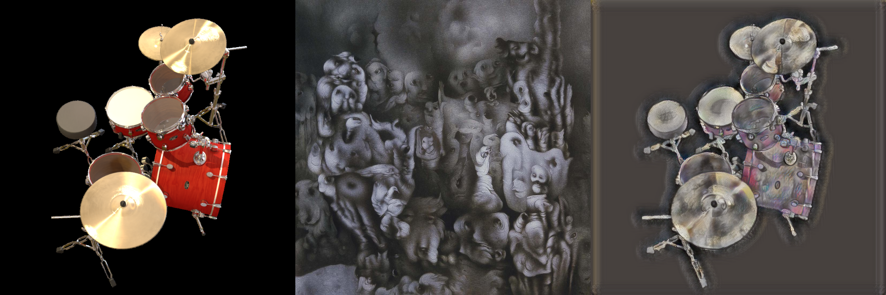
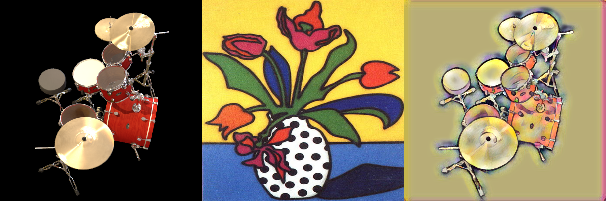
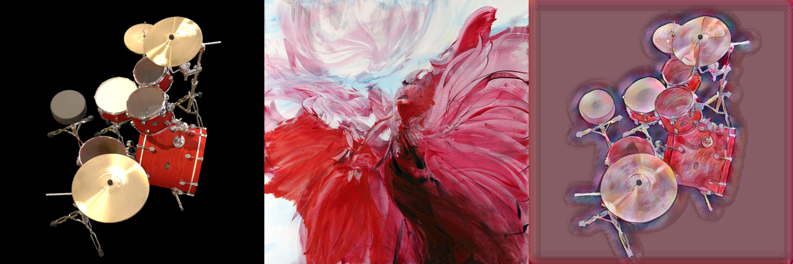

# Stylize NeRF with AdaIN 

[](https://arxiv.org/abs/2406.04960)

[](https://docs.google.com/presentation/d/e/2PACX-1vS8BNl5ONMOmT4AqOY0WVw8T3ZR-cLWvtVA3hgSiAsTg46B0YKnTGRVgDEp_IZHtNNeEHC_VDWimkUv/pub?start=false&loop=false&delayms=3000)

## Visual results


## AdaIN results








# NeRF results


# Directly Style Transfer by AdaIN on NeRF


# Train NeRF on Style-Transfered Images by AdaIN


## Introduction and More Results

[Stylize NeRF with AdaIN](https://docs.google.com/presentation/d/e/2PACX-1vS8BNl5ONMOmT4AqOY0WVw8T3ZR-cLWvtVA3hgSiAsTg46B0YKnTGRVgDEp_IZHtNNeEHC_VDWimkUv/pub?start=false&loop=false&delayms=3000)


## Citation
The original paper of AdaIN
```
@inproceedings{huang2017adain,
  title={Arbitrary Style Transfer in Real-time with Adaptive Instance Normalization},
  author={Huang, Xun and Belongie, Serge},
  booktitle={ICCV},
  year={2017}
}
```

The original paper of NeRF
```
@misc{mildenhall2020nerf,
    title={NeRF: Representing Scenes as Neural Radiance Fields for View Synthesis},
    author={Ben Mildenhall and Pratul P. Srinivasan and Matthew Tancik and Jonathan T. Barron and Ravi Ramamoorthi and Ren Ng},
    year={2020},
    eprint={2003.08934},
    archivePrefix={arXiv},
    primaryClass={cs.CV}
}
```

pytorch-implementation for NeRF
```
@misc{lin2020nerfpytorch,
  title={NeRF-pytorch},
  author={Yen-Chen, Lin},
  publisher = {GitHub},
  journal = {GitHub repository},
  howpublished={\url{https://github.com/yenchenlin/nerf-pytorch/}},
  year={2020}
}
```
